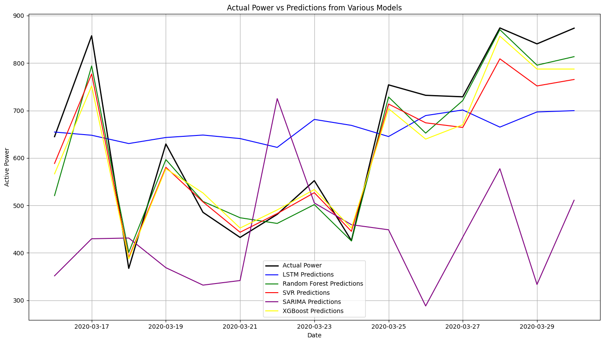
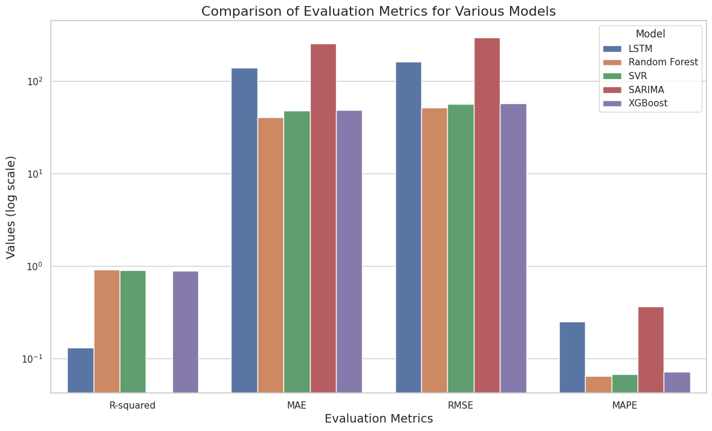

# Wind Power Forecasting: Comparative Study of ML Models

This project presents a comparative analysis of five machine learning models for wind power prediction using multivariate time series data. It evaluates LSTM, Random Forest, SVR, SARIMA, and XGBoost on real-world turbine data using comprehensive preprocessing, feature engineering, and model tuning.

---

## Project Summary

Accurate wind power forecasting is critical for integrating renewable energy into modern grids. This project benchmarks traditional and modern ML approaches under the same pipeline to identify the most efficient and reliable method.

---

## Models Compared

- **LSTM**: Captures temporal dependencies in meteorological sequences.
- **Random Forest (RF)**: Robust ensemble method; handles feature interactions well.
- **Support Vector Regression (SVR)**: Effective with non-linear regression under high-dimensional settings.
- **SARIMA**: Captures seasonality and trend; interpretable statistical model.
- **XGBoost**: Gradient boosting model known for high accuracy and scalability.

---

## Dataset

- Source: Kaggle – Wind Turbine Power Forecasting
- Duration: Jan 2018 – Mar 2020 (10-min intervals)
- Attributes: DateTime, Wind Speed, Direction, Temperature, Pressure, Humidity, Active Power, etc.
- Size: 118,225 rows × 22 attributes

### Preprocessing & Feature Engineering

- Handled missing and erroneous power values (e.g., negative power set to 0)
- Normalization and outlier filtering
- Derived lagged features to improve temporal modeling
- Train/Val/Test split: 70% / 20% / 10%
- Models evaluated on last 15 days of the dataset

---

## Performance Summary

| Model      | R² Score     | MAE        | RMSE       | MAPE       |
|------------|--------------|------------|------------|------------|
| LSTM       | Highest      | Low        | Low        | Low        |
| RF         | High         | Low        | Low        | Low        |
| XGBoost    | High         | Low        | Low        | Low        |
| SVR        | Moderate     | Moderate   | Moderate   | Moderate   |
| SARIMA     | Low          | High       | High       | High       |

**Winner**: LSTM slightly outperforms others in capturing long-term dependencies, followed by XGBoost and Random Forest.

---

## Repository Structure

```
├── data/
│   └── Turbine_Data.csv
├── Wind_Power_Prediction.ipynb
├── README.md
└── LICENSE
```

---

## Key Insights

- **LSTM** excels with temporal patterns and meteorological inputs.
- **XGBoost and RF** handle non-linearities and anomalies well.
- **SARIMA**, while interpretable, struggles with complex modern datasets.
- **Feature engineering and preprocessing** are crucial for model performance.

---

## Model Prediction Visuals

### Actual Power vs Predictions from Various Models

*Fig. 1: Predicted vs Actual Wind Power*

### Comparison of Evaluation Metrics for Various Models

*Fig. 2: Comparison Metrics*

---

## License

This project is licensed under the MIT License. See the [LICENSE](./LICENSE) file for more details.
